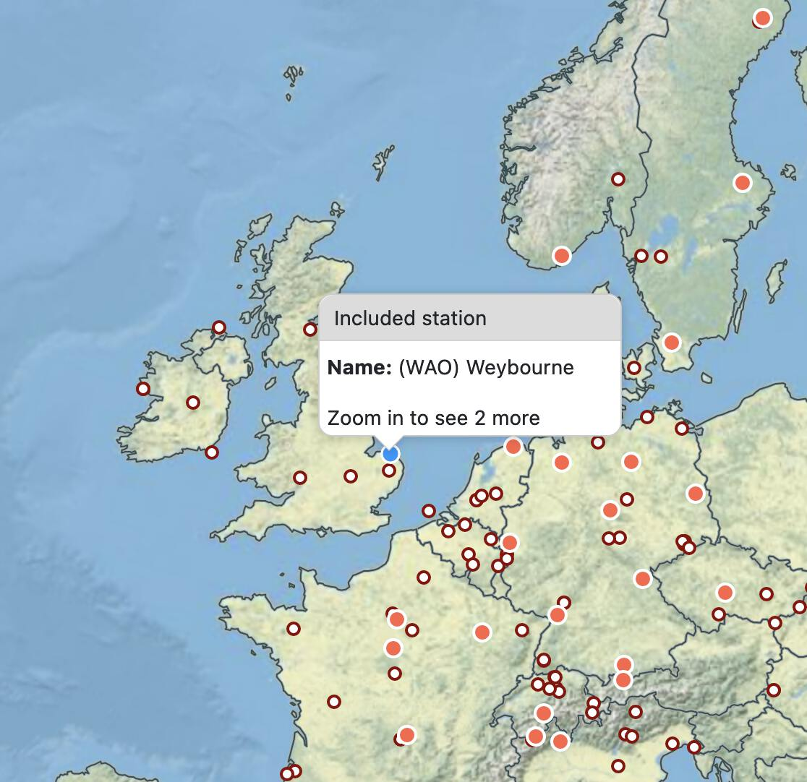

---
jupytext:
  formats: ipynb,md:myst
  text_representation:
    extension: .md
    format_name: myst
    format_version: 0.13
    jupytext_version: 1.14.0
kernelspec:
  display_name: Python 3 (ipykernel)
  language: python
  name: python3
---

# Workflow 6: Retrieving data from remote archives

+++

This tutorial covers the retrieval of data from the ICOS Carbon Portal and the CEDA archives.

+++

## ICOS

+++

It's easy to retrieve atmospheric gas measurements from the [ICOS Carbon Portal](https://www.icos-cp.eu/observations/carbon-portal) using OpenGHG. To do so we'll use the `retrieve_icos` function from `openghg.client`.

+++

### Checking available data

+++

You can find the stations available in ICOS using [their map interface](https://data.icos-cp.eu/portal/#%7B%22filterCategories%22%3A%7B%22project%22%3A%5B%22icos%22%5D%2C%22level%22%3A%5B1%2C2%5D%2C%22stationclass%22%3A%5B%22ICOS%22%5D%2C%22theme%22%3A%5B%22atmosphere%22%5D%7D%2C%22tabs%22%3A%7B%22resultTab%22%3A2%7D%7D). Click on a site to see it's information, then use it's three letter site code to retrieve data. You can also use the [search page](https://data.icos-cp.eu/portal/#%7B%22filterCategories%22:%7B%22project%22:%5B%22icos%22%5D,%22level%22:%5B1,2%5D,%22stationclass%22:%5B%22ICOS%22%5D%7D%7D) to find available data at a given site.

+++

<div>

</div>

+++

### Using `retrieve_icos`

First we'll import `retrieve_icos` from the `client` submodule, then we'll retrieve some data from Weybourne (**WAO**). The function will first check for any data from **WAO** already stored in the object store, if any is found it is returned, otherwise it'll retrieve the data from the ICOS Carbon Portal, this may take a bit longer.

```{code-cell} ipython3
from openghg.retrieve.icos import retrieve_atmospheric
```

```{code-cell} ipython3
wao_data = retrieve_atmospheric(site="WAO", species="ch4")
```

Now we can inspect `wao_data`, an `ObsData` object to see what was retrieved.

```{code-cell} ipython3
wao_data
```

We can see that we've retrieved `ch4` data that covers 2013-04-01 - 2015-07-31. Quite a lot of metadata is saved during the retrieval process, including where the data was retrieved from (`dobj_pid` in the metadata), the instruments and their associated metadata and a citation string.

You can see more information about the instruments by going to the link in the `instrument_data` section of the metadata

```{code-cell} ipython3
metadata = wao_data.metadata
instrument_data = metadata["instrument_data"]
citation_string = metadata["citation_string"]
```

Here we get the instrument name and a link to the instrument data on the ICOS Carbon Portal.

```{code-cell} ipython3
instrument_data
```

And we can easily get the citation string for the data

```{code-cell} ipython3
citation_string
```

### Viewing the data

As with any `ObsData` object we can quickly plot it to have a look.

> **_NOTE:_**  the plot created below may not show up on the online documentation version of this notebook.

```{code-cell} ipython3
wao_data.plot_timeseries()
```

### Data levels

Data available on the ICOS Carbon Portal is made available under three different levels ([see docs](https://icos-carbon-portal.github.io/pylib/modules/#stationdatalevelnone)).

```
- Data level 1: Near Real Time Data (NRT) or Internal Work data (IW).
- Data level 2: The final quality checked ICOS RI data set, published by the CFs,
                to be distributed through the Carbon Portal.
                This level is the ICOS-data product and free available for users.
- Data level 3: All kinds of elaborated products by scientific communities
                that rely on ICOS data products are called Level 3 data.
```

By default level 2 data is retrieved but this can be changed by passing `data_level` to `retrieve_icos`. Below we'll retrieve some more recent data from **WAO**.

```{code-cell} ipython3
wao_data_level1 = retrieve_icos(site="WAO", species="CH4", data_level=1)
```

```{code-cell} ipython3
wao_data_level1
```

You can see that we've now got data from 2021-07-01 - 2022-04-24. The ability to retrieve different level data has been added for convenienve, choose the best option for your workflow.

> **_NOTE:_**  level 1 data may not have been quality checked.

```{code-cell} ipython3
wao_data_level1.plot_timeseries(title="WAO - Level 1 data")
```

### Forcing retrieval

As ICOS data is cached by OpenGHG you may sometimes need to force a retrieval from the ICOS Carbon Portal.

If you retrieve data using `retrieve_icos` and notice that it does not return the most up to date data (compare the dates with those on the portal) you can force a retrieval using `force_retrieval`.

```{code-cell} ipython3
new_data = retrieve_icos(site="WAO", species="CH4", data_level=1, force_retrieval=True)
```

Here you may notice we get a message telling us there is no new data to process, if you force a retrieval and there is no newer data you'll see this message.

+++

## CEDA

To retrieve data from CEDA you can use the `retrieve_ceda` function from `openghg.client`. This lets you pull down data from CEDA, process it and store it in the object store. Once the data has been stored successive calls will retrieve the data from the object store.

> **_NOTE:_**  For the moment only surface observations can be retrieved and it is expected that these are already in a NetCDF file. If you find a file that can't be processed by the function please [open an issue on GitHub](https://github.com/openghg/openghg/issues/new/choose) and we'll do our best to add support that file type.

+++

To pull data from CEDA you'll first need to find the URL of the data. To do this use the [CEDA data browser](https://data.ceda.ac.uk/badc) and copy the link to the file (right click on the download button and click copy link / copy link address). You can then pass that URL to `retrieve_ceda`, it will then download the data, do some standardisation and checks and store it in the object store.

We don't currently support downloading restricted data that requires a login to access. If you'd find this useful please open an issue at the link given above.

Now we're ready to retrieve the data.

```{code-cell} ipython3
from openghg.retrieve.ceda import retrieve_surface
```

```{code-cell} ipython3
url = "https://dap.ceda.ac.uk/badc/gauge/data/tower/heathfield/co2/100m/bristol-crds_heathfield_20130101_co2-100m.nc?download=1"
```

```{code-cell} ipython3
hfd_data = retrieve_surface(url=url)
```

Now we've got the data, we can use it as any other `ObsData` object, using `data` and `metadata`.

```{code-cell} ipython3
hfd_data.plot_timeseries()
```

### Retrieving a second time

+++

The second time we (or another use) retrieves the data it will be pulled from the object store, this should be faster than retrieving from CEDA. To get the same data again use the `site`, `species` and `inlet` arguments.

```{code-cell} ipython3
hfd_data2 = retrieve_surface(site="hfd", species="co2")
```

```{code-cell} ipython3
hfd_data2
```
